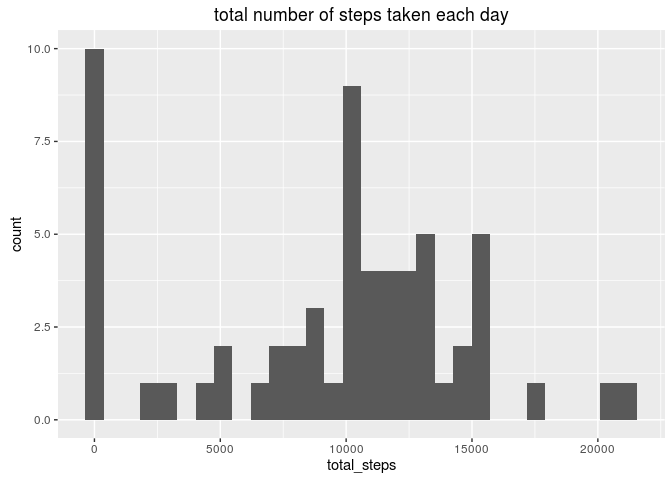
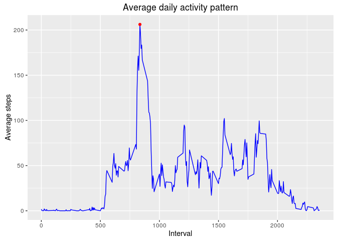
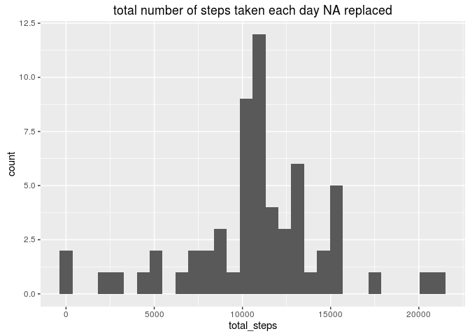
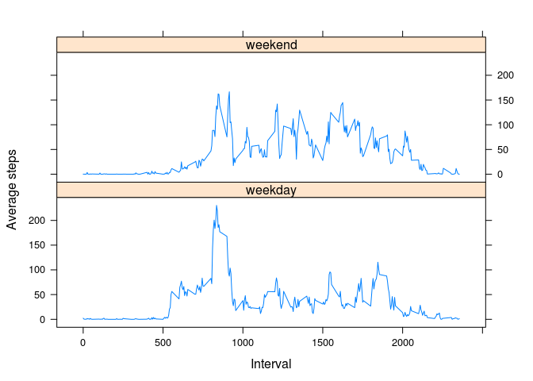

# Reproducible Research: Peer Assessment 1


## Loading and preprocessing the data
* Import libraries

```r
library(dplyr)
library(ggplot2)
library(lattice)
```
* Read data

```r
unzip("activity.zip")
data <- read.csv("activity.csv")
```

* Preprocessing

```r
total <- data %>% group_by(date) %>%  summarise(total_steps=sum(steps, na.rm=TRUE))
```

## What is mean total number of steps taken per day?
* Histogram of the total number of steps taken each day

```r
ggplot(total, aes(x = total_steps)) + geom_histogram() + ggtitle("total number of steps taken each day")
```

<!-- -->

* Mean and median:
    + mean total number of steps taken per day is **9354.2295082** steps.
    + median total number of steps taken per day is **10395** steps.

## What is the average daily activity pattern?

```r
interval_df <- data %>% group_by(interval) %>%  
  summarise(avg_steps_inteval=mean(steps, na.rm=TRUE)) %>%  
  mutate(color = (max(avg_steps_inteval) == avg_steps_inteval))

ggplot(interval_df, aes(x = interval, y = avg_steps_inteval)) + 
  geom_line(color="blue") + 
  ggtitle("Average daily activity pattern") + xlab("Interval") + ylab("Average steps") +
  geom_point(aes(color = color)) + scale_color_manual(values = c(NA, "red")) + theme(legend.position="none")
```

<!-- -->

* Which 5-minute interval, on average across all the days in the dataset, contains the maximum number of steps?
    + **835**

## Imputing missing values
1. Total number of missing values in the dataset: **2304**
2. Devise a strategy for filling in all of the missing values in the dataset. The strategy does not need to be sophisticated. For example, you could use the mean/median for that day, or the mean for that 5-minute interval, etc.
3. Create a new dataset that is equal to the original dataset but with the missing data filled in.

```r
data_without_na <- data %>% group_by(interval) %>% mutate(steps = ifelse(is.na(steps), mean(steps, na.rm = TRUE), steps))
```
4. Make a histogram of the total number of steps taken each day and Calculate and report the mean and median total number of steps taken per day. Do these values differ from the estimates from the first part of the assignment? What is the impact of imputing missing data on the estimates of the total daily number of steps?

```r
total_without_na <- data_without_na %>% group_by(date) %>%  summarise(total_steps=sum(steps, na.rm=TRUE))
ggplot(total_without_na, aes(x = total_steps)) + geom_histogram() + ggtitle("total number of steps taken each day NA replaced")
```

<!-- -->

* Mean and median:
    + mean total number of steps taken per day is **1.0766189\times 10^{4}** steps. 
    + median total number of steps taken per day is **1.0766189\times 10^{4}** steps.
* Mean and median values are changed, because NA values were replaced with mean value for given interval

## Are there differences in activity patterns between weekdays and weekends?
1. Create a new factor variable in the dataset with two levels -- "weekday" and "weekend" indicating whether a given date is a weekday or weekend day.

```r
data_without_na <- data_without_na %>% mutate(weekday_weekend=ifelse(weekdays(as.Date(date))=="Saturday" | weekdays(as.Date(date))=="Sunday" , "weekend", "weekday"))
```
2. Make a panel plot containing a time series plot (i.e. type = "l") of the 5-minute interval (x-axis) and the average number of steps taken, averaged across all weekday days or weekend days (y-axis).

```r
interval_df_without_na <- data_without_na %>% group_by(interval, weekday_weekend) %>%  
  summarise(avg_steps_inteval=mean(steps, na.rm=TRUE)) 

xyplot(avg_steps_inteval~interval | weekday_weekend, data = interval_df_without_na,
       type = 'l',
       xlab = 'Interval',
       ylab = 'Average steps',
       layout = c(1,2))
```

<!-- -->
